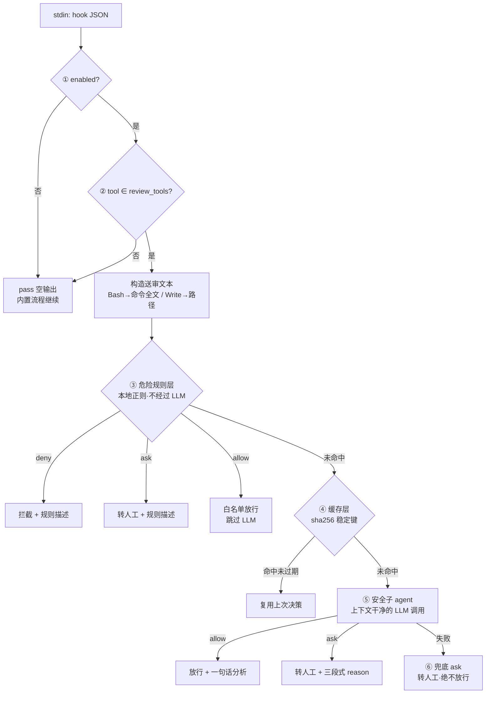

# 模块设计：决策管线（reviewer.js）

## 六层管线（顺序固定，先确定性后概率性）



## 关键不变量

1. **单调收窄**：任何一层失败只会让决策更保守；`allow` 的前提是明确的安全证据。
2. **确定性优先**：规则层永远在 LLM 之前，LLM 无法覆盖用户显式规则。
3. **LLM 无 deny 权**：模型输出 deny 收敛为 ask；拦截特权仅属于用户规则。
4. **不抛异常**：`reviewToolUse` 最外层 try/catch 把一切异常映射为兜底 ask；
   hook_main 再兜一层（exit 2 阻断）。两个出口都不存在"异常→放行"路径。

## 缓存键设计

`sha256(tool_name + "\n" + stableStringify(tool_input))`，
其中 stableStringify 递归按键排序——`{command, description}` 与 `{description, command}`
生成同一键，等价调用命中同一缓存。只有 LLM 结论入缓存（规则层即时、规则变更后旧缓存无效）。

## reason 三段式（转人工时展示）

```
[auto-review] 风险级别 high: 使用 curl 将 .env 内容 POST 到外部地址
风险点:
- 会把密钥等敏感信息上传到外部端点
- 端点合法性无法确认
影响范围: 本地 .env、外部网络地址 https://...
```

## 失败兜底的语义

| 失败 | 结果 |
|------|------|
| provider 配置缺失/无 apiKey | ask + 具体原因（如"OAuth 型凭证不支持直连"） |
| LLM 超时（AbortController） | ask + "请求超时" |
| HTTP 非 2xx | ask + 状态码与截断的错误体 |
| 模型输出不可解析 | ask + "模型输出不是合法 JSON" |
| 管线未知异常 | ask（外层 catch） |
| hook 进程自身崩溃 | exit 2 阻断（decision.emitCrash） |
