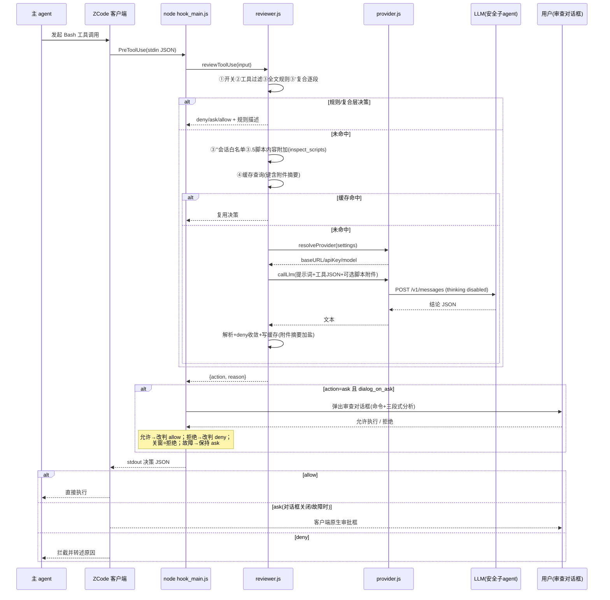
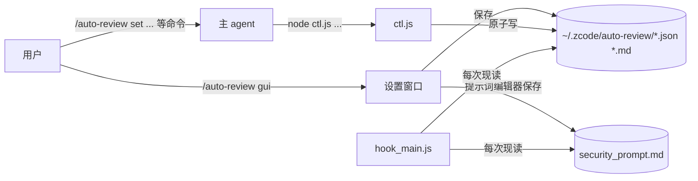
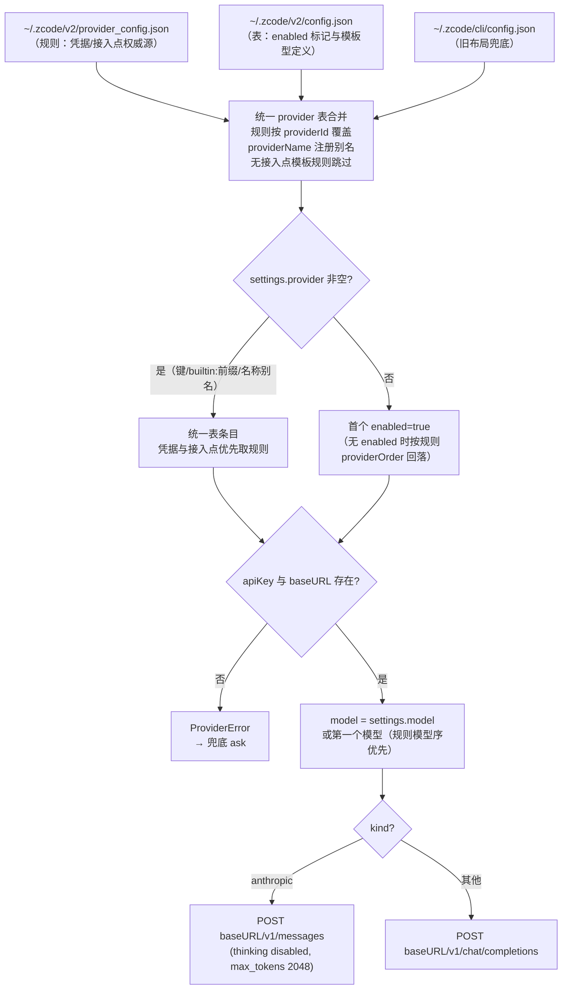

# 模块运行流程图

## 一次命令审查的完整时序（含对话框裁决）

```mermaid
sequenceDiagram
    participant M as 主 agent
    participant Z as ZCode 客户端
    participant H as node hook_main.js
    participant R as reviewer.js
    participant P as provider.js
    participant L as LLM(安全子agent)
    participant U as 用户(审查对话框)

    M->>Z: 发起 Bash 工具调用
    Z->>H: PreToolUse(stdin JSON)
    H->>R: reviewToolUse(input)
    R->>R: ①开关②工具过滤③全文规则③'复合逐段
    alt 规则/复合层决策
        R-->>H: deny/ask/allow + 规则描述
    else 未命中
        R->>R: ③''会话白名单③.5脚本内容附加(inspect_scripts)
        R->>R: ④缓存查询(键含附件摘要)
        alt 缓存命中
            R-->>H: 复用决策
        else 未命中
            R->>P: resolveProvider(settings)
            P-->>R: baseURL/apiKey/model
            R->>P: callLlm(提示词+工具JSON+可选脚本附件)
            P->>L: POST /v1/messages (thinking disabled)
            L-->>P: 结论 JSON
            P-->>R: 文本
            R->>R: 解析+deny收敛+写缓存(附件摘要加盐)
        end
    end
    R-->>H: {action, reason}
    alt action=ask 且 dialog_on_ask
        H->>U: 弹出审查对话框(命令+三段式分析)
        U-->>H: 允许执行 / 拒绝
        Note over H: 允许→改判 allow；拒绝→改判 deny；<br/>关窗=拒绝；故障→保持 ask
    end
    H-->>Z: stdout 决策 JSON
    alt allow
        Z-->>M: 直接执行
    else ask(对话框关闭/故障时)
        Z-->>U: 客户端原生审批框
    else deny
        Z-->>M: 拦截并转述原因
    end
```

## 用户改配置的路径

```mermaid
flowchart LR
    U[用户] -->|"/auto-review gui"| W[设置窗口]
    U -->|"/auto-review set ... 等命令"| C[主 agent]
    W -->|保存| D[(~/.zcode/auto-review/*.json *.md)]
    W -->|提示词编辑器保存| PM[(security_prompt.md)]
    C -->|"node ctl.js ..."| S[ctl.js]
    S -->|原子写| D
    H[hook_main.js] -->|每次现读| D
    H -->|每次现读| PM
```

## provider 解析顺序

三源合并为统一 provider 表（0.2.4）后按名/跟随解析：

```mermaid
flowchart TD
    A1["~/.zcode/v2/provider_config.json<br/>（规则：凭据/接入点权威源）"] --> M[统一 provider 表合并<br/>规则按 providerId 覆盖<br/>providerName 注册别名<br/>无接入点模板规则跳过]
    A2["~/.zcode/v2/config.json<br/>（表：enabled 标记与模板型定义）"] --> M
    A3["~/.zcode/cli/config.json<br/>（旧布局兜底）"] --> M
    M --> B{settings.provider 非空?}
    B -- "是（键/builtin:前缀/名称别名）" --> C["统一表条目<br/>凭据与接入点优先取规则"]
    B -- 否 --> D[首个 enabled=true<br/>（无 enabled 时按规则<br/>providerOrder 回落）]
    C --> E{apiKey 与 baseURL 存在?}
    D --> E
    E -- 否 --> X[ProviderError<br/>→ 兜底 ask]
    E -- 是 --> F2[model = settings.model<br/>或第一个模型（规则模型序优先）]
    F2 --> G{kind?}
    G -- anthropic --> H["POST baseURL/v1/messages<br/>(thinking disabled, max_tokens 2048)"]
    G -- 其他 --> I[POST baseURL/v1/chat/completions]
```
