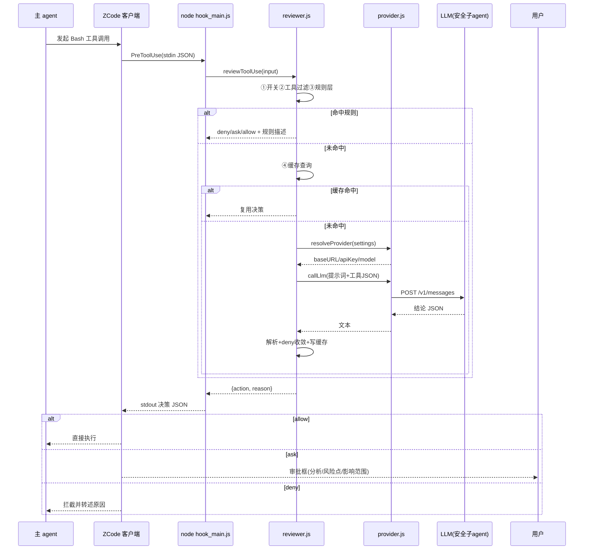
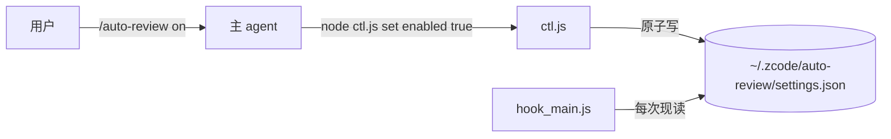
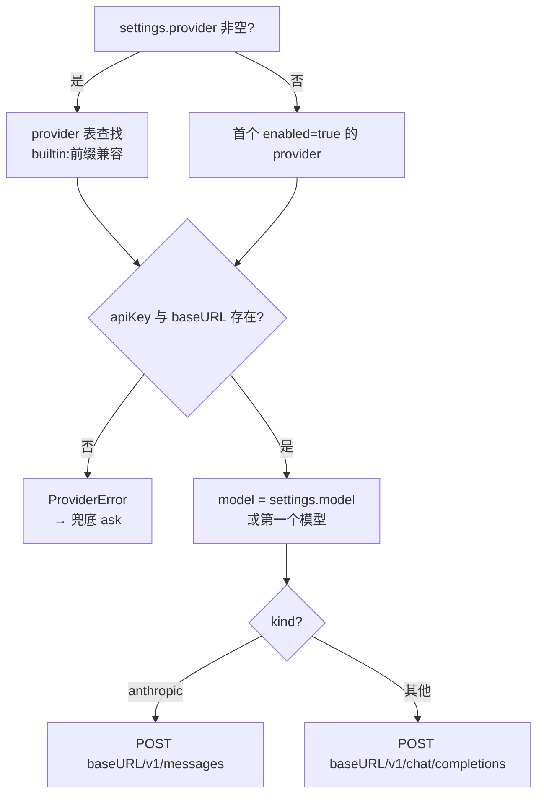

# 模块运行流程图

## 一次命令审查的完整时序

```mermaid
sequenceDiagram
    participant M as 主 agent
    participant Z as ZCode 客户端
    participant H as node hook_main.js
    participant R as reviewer.js
    participant P as provider.js
    participant L as LLM(安全子agent)

    M->>Z: 发起 Bash 工具调用
    Z->>H: PreToolUse(stdin JSON)
    H->>R: reviewToolUse(input)
    R->>R: ①开关②工具过滤③规则层
    alt 命中规则
        R-->>H: deny/ask/allow + 规则描述
    else 未命中
        R->>R: ④缓存查询
        alt 缓存命中
            R-->>H: 复用决策
        else 未命中
            R->>P: resolveProvider(settings)
            P-->>R: baseURL/apiKey/model
            R->>P: callLlm(提示词+工具JSON)
            P->>L: POST /v1/messages
            L-->>P: 结论 JSON
            P-->>R: 文本
            R->>R: 解析+deny收敛+写缓存
        end
    end
    R-->>H: {action, reason}
    H-->>Z: stdout 决策 JSON
    alt allow
        Z-->>M: 直接执行
    else ask
        Z-->>用户: 审批框(分析/风险点/影响范围)
    else deny
        Z-->>M: 拦截并转述原因
    end
```

## 用户改配置的路径

```mermaid
flowchart LR
    U[用户] -->|"/auto-review on"| C[主 agent]
    C -->|"node ctl.js set enabled true"| S[ctl.js]
    S -->|原子写| D[(~/.zcode/auto-review/settings.json)]
    H[hook_main.js] -->|每次现读| D
```

## provider 解析顺序

```mermaid
flowchart TD
    A[settings.provider 非空?] -- 是 --> B["provider 表查找<br/>builtin:前缀兼容"]
    A -- 否 --> C[首个 enabled=true 的 provider]
    B --> D{apiKey 与 baseURL 存在?}
    C --> D
    D -- 否 --> E[ProviderError<br/>→ 兜底 ask]
    D -- 是 --> F[model = settings.model<br/>或第一个模型]
    F --> G{kind?}
    G -- anthropic --> H[POST baseURL/v1/messages]
    G -- 其他 --> I[POST baseURL/v1/chat/completions]
```
